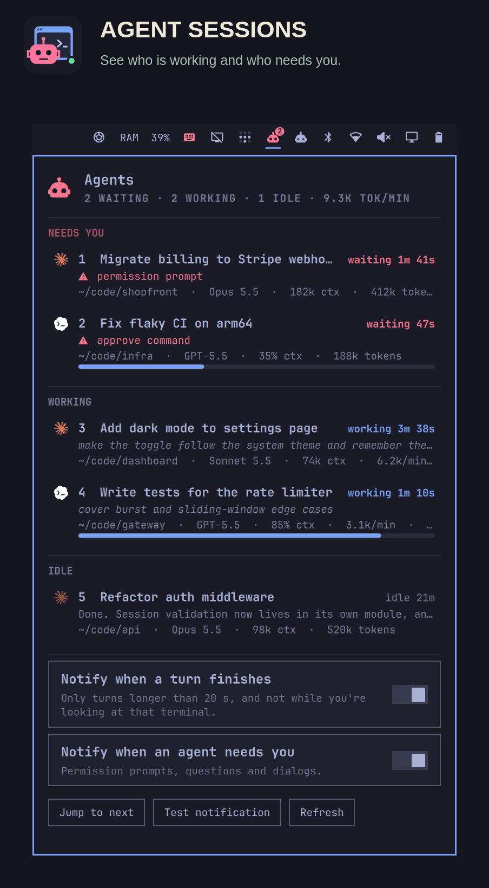

# Agent Sessions (grivera.agents)

Omarchy bar widget that shows every Claude Code and Codex session running on this
machine. You can see which ones are working, which ones are waiting on you (a
permission prompt, a question, a dialog), and how fast each is burning tokens. It
sends a desktop notification when a long turn finishes or an agent stops to ask you
something. Clicking the notification, or a row in the panel, focuses that session's
terminal window.



It complements the built-in `omarchy.agents` widget, which covers plan limits and
usage history. This one covers what's running right now.

**How it differs from other agent plugins:** it covers both Claude Code and Codex,
with no setup. It doesn't need herdr, tmux or hooks, because it reads the files both
CLIs already keep. On top of working/waiting state, it shows tokens per minute and
context fill, and it focuses the exact terminal window for each session.

**Privacy:** it reads only local files, makes no network requests, and nothing
leaves your machine.

## Install

Use Omarchy's plugin manager:

```
omarchy plugin add https://github.com/grivera82/omarchy-agents.git --enable
```

This clones the plugin into `~/.config/omarchy/plugins/grivera.agents`, checks it,
and adds the widget to your bar. When run interactively, it asks which bar section
to use (default: right). Without `--enable`, you can turn it on later with:

```
omarchy plugin enable grivera.agents --section right
```

To update or uninstall:

```
omarchy plugin update grivera.agents
omarchy plugin disable grivera.agents   # hide it but keep it installed
omarchy plugin remove grivera.agents    # delete it
rm -rf ~/.local/state/grivera-agents    # optional: notification settings
```

The plugin writes only its settings file, in `~/.local/state/grivera-agents/`. It
never changes anything Claude Code or Codex owns.

There's nothing to configure. It reads files that both CLIs already write:

| | Live state | Tokens and titles |
|---|---|---|
| Claude Code | `~/.claude/sessions/<pid>.json` (`busy` / `idle` / `waiting` and the reason) | the session transcript in `~/.claude/projects/` |
| Codex | the thread index in `~/.codex/state_*.sqlite`, plus running `codex` processes | the rollout in `~/.codex/sessions/` (turns, approvals, `token_count`) |

`CLAUDE_CONFIG_DIR` and `CODEX_HOME` are honoured. It needs Python 3 (standard
library only) and `hyprctl`. Omarchy already includes both.

> **Caveat:** Claude Code's live state comes from its internal session registry
> (`~/.claude/sessions/*.json`), which isn't a documented format. A Claude Code
> update could change it and break the working/waiting status until the plugin
> catches up. Codex's thread index and rollouts are internal too.

## Bar widget

- The robot icon **breathes** while any agent is working, and a badge shows how
  many are working.
- It turns **red** when an agent is waiting on you, and the badge then counts the
  waiting sessions.
- **Left click**: open the panel.
- **Right click**: jump to the next session that needs you, meaning the one that's
  been waiting longest, or else the one that finished most recently.
- **Middle click**: rescan now.

The panel groups sessions under **Needs you**, **Working** and **Idle**. Each row
shows:

- the title (Claude's AI title or your `/rename`, or the Codex thread name)
- how long it's been in that state
- the current prompt (while working), the reason (while waiting), or the last reply
  (while idle)
- the folder, the model, the context size, tokens per minute over the last 5
  minutes, and fresh tokens for the session

Codex reports its context window, so Codex rows also get a context fill bar.

"Fresh" tokens are input plus cache writes plus output. Cache reads are left out
because they would swamp the number without saying much about how hard a session is
working. Subagent transcripts count toward their parent session.

Keys in the panel: `1`–`9` focus that session, `n` jumps to the next one, and `r`
rescans.

## Notifications

- **Finished**: a turn that ran at least `minTurnSeconds` (default 20) went idle. The
  notification shows the agent's last reply.
- **Needs you**: a session started waiting on a permission prompt, question or
  dialog. The notification is withdrawn as soon as the session moves on.

Notifications go straight to the notification server over D-Bus, not through
`notify-send`, so a reply excerpt never appears on a command line where other users
on the machine could read it.

There's no notification for a session in the window you're focused on. Both kinds
can be switched off in the panel. Settings live in
`~/.local/state/grivera-agents/config.json`.

## CLI

```
bin/agents status [--json]   # one-shot report
bin/agents focus next        # focus the session that needs you
bin/agents focus <id|pid>    # focus a specific session
bin/agents daemon            # what the shell runs: JSON lines in and out
```

`focus next` works without the shell, so it can go on a key. For example, in
`~/.config/hypr/bindings.lua`:

```lua
local agents = os.getenv("HOME") .. "/.config/omarchy/plugins/grivera.agents/bin/agents"
o.bind("SUPER + ALT + A", "Jump to waiting agent", agents .. " focus next")
```

## How a session finds its window

The plugin walks up from the agent's process to the Hyprland client that owns it.
Some terminals (Ghostty, for example) run every window from one process. In that case
it picks the window whose title matches the one Claude Code set. Sessions inside
tmux or over SSH have no window of their own, so they're listed but can't be focused.

Codex sessions running in the IDE extension or the desktop app have no CLI process.
They stay listed for 10 minutes after their last activity.

## License

MIT. The Claude and Codex marks in `assets/` come from Omarchy's `omarchy.agents`
plugin (MIT) and belong to their owners.
